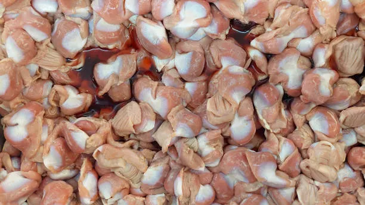

# Automated Sound Spatulas (A.S.S.)



A collection of Python-based sound giblets.  Can be run directly or combined into beautiful offal.

## Why?!

Experimental audio is a thing.

## Requirements

* Python
* MacOS (for now, deal with it)
* Speakers set to 'on'

```
open terminal, then

git clone https://github.com/christophervigliotti/automated_sound_spatula.git

cd automated_sound_spatula

python3 -m venv .venv

.venv/bin/pip install -r requirements.txt

Then pick a giblet below and run it.  or run an offal.
```


## Giblets

### Hello World

#### Dependencies
None

#### Usage
```
python3 -m venv .venv
.venv/bin/pip install -r requirements.txt
.venv/bin/python giblets/helloWorld/play.py
```

#### Description
The mad scientist's mouth. Type in any words you want, and it puts them through a haunted
text-to-speech machine, mangles each one with a random audio effect, and hands you back a
pile of ready-to-abuse sound bites. Every other giblet in this repo lives off of what Hello
World cooks up.

#### Bland Technical Descripton 
Captures each word of `SPEAKS_THESE_WORDS`, spoken at `SPEECH_RATE` words per minute, as its
own numbered sample (`sample-helloWorld-0001.wav`, `-0002.wav`, ...), applies a random effect
from `EFFECTS_NAMES` (reverb, delay, phaser, distortion, pitch shift) to each one, then
stitches the effected samples back together with a `PAUSE_FROM_SILENCE_UNTIL_NEXT_WORD` gap
between them into the session recording, and plays that back. `SAMPLE_DIRECTION` controls
which order the words are captured/numbered in: `forward`, `backward`, `alternating-random`,
or `alternating-toggle` (strictly alternates between the front and back of the word list).


### Poops Per Minute

#### Dependencies

Samples (from Hello World)

#### Usage
```
.venv/bin/python giblets/poopsPerMinute/play.py
```

#### Description
A tempo-locked toilet symphony. Grabs whatever Hello World left lying around, drenches it in
reverb/delay/distortion, and loops it into an overlapping, glitchy little drum machine made
entirely of spoken garbage. Comes with a `stumbleForward` mode for when the beat should sound
like it's had a few too many.

#### Bland Technical Descripton

Sequences the existing `samples/sample-helloWorld-*.wav` pool, drawn per `SAMPLE_DIRECTION`
(`forward`, `backward`, `alternating-random`, or `alternating-toggle` between the front and
back of the pool), in `LOOPS` loops of `SAMPLES_PER_LOOP`
samples each, ordered per a randomly chosen mode from `SEQUENCE` (`random`, `ascending`,
`descending`, `stumbleForward`), played at `BPM`. `stumbleForward` walks the words first to
last, with a `STUMBLE_FORWARD_PERCENTANCE_CHANCE`% chance at each step of moving back one
word instead of advancing; after a stumble, the next two steps always advance forward before
another stumble can trigger (so it may replay earlier words and not always reach the last
one). If the pool runs low on unused samples mid-run, it refills
from the full set. Each sample is played through a throwaway copy with the `EFFECT` applied
(the original samples are never modified). At most `SAMPLES_AT_A_TIME` samples may play back
overlapping at once -- once a new one starts, the oldest still-playing sample beyond that cap
is stopped. The same sample is never played twice in a row, including across a loop boundary.
Press Escape during a run to stop early. When `DICED_UP_NICE` is on, each sample is trimmed
down to a fixed `DICED_UP_NICE_SLICE_SECONDS`-long section from its middle before playing, so
every hit is the same length. When `MIRROR_UNIVERSE_CAVE` is on, each sample also fires a
second, reversed, half-volume copy of itself `MIRROR_UNIVERSE_CAVE_OFFSET_SECONDS` later as an
echo layer, mixed into the saved session at that same offset. The whole run's primary effected
samples (plus any echo layer) are stitched/mixed together (with a gap matching the beat
interval between primary hits) into a session recording afterward, same as helloWorld.

## Other Stuff

### Offal

`offal/` holds orchestration scripts that chain multiple giblets together with custom
overrides, rather than being giblets themselves. Each giblet's `play.py` exposes a `run()`
function that accepts optional overrides (falling back to its module-level defaults when
called with none), so `python giblets/<name>/play.py` still works standalone.

- `offal/sloppy.py`: deletes existing samples/sessions, runs helloWorld with custom words
  (`WORDS`, an offal/giblets definition) without playing the result back, then sequences the
  resulting samples through poopsPerMinute with a custom sequence mode and BPM
  (`POOPS_SEQUENCE`, `POOPS_BPM`).

```
.venv/bin/python offal/sloppy.py
```

### Capture

`capture/session_capture.py` holds shared logic for saving what a giblet plays, via `pyttsx3`
(transcoded to wav with macOS's built-in `afconvert`).

- `capture_session(text, giblet_name)` speaks aloud and saves the full run to the
  `sessions/` folder, named `yyyy-mm-dd-hh-mm-ss-gibletName.wav`. `text` may include speech
  embedded commands (e.g. `[[slnc 500]]` for a 500ms pause) so pauses are captured naturally.
- `capture_sample(text, giblet_name, descriptor)` renders (without playing aloud) and saves a
  reusable clip to the `samples/` folder, named `sample-gibletName-descriptor.wav`. Samples
  aren't timestamped, so capturing the same descriptor again overwrites the previous file.
- `build_session_from_clips(clip_paths, giblet_name, gap_seconds, echo_paths=None, echo_offset_seconds=0.0)`
  stitches already-rendered wav clips (e.g. effected samples) together with silence gaps into
  a session recording. If `echo_paths` is given (one entry per clip, `None` for no echo), each
  echo clip is additively mixed in starting `echo_offset_seconds` after its clip begins.
- `play_wav(path)` plays a wav file aloud via macOS's built-in `afplay`.

### Effects

`capture/effects.py` applies audio effects to an already-captured wav file, in place, via
`apply_random_effect(path, effect_names)`. Reverb, distortion, and pitch shift come from
[audiomentations](https://github.com/iver56/audiomentations) (MIT-licensed, independently
maintained, not corporate-backed); delay and phaser aren't in its transform set, so they're
hand-rolled with plain numpy.

### Samples

Some Giblets capture audio segments for resample etc.  Those segments are stored here.

### Sessions

Giblet session audio files are captured here.

### Utils

`util/delete_samples.py` and `util/delete_sessions.py` delete every `.wav` file in
`samples/` and `sessions/` respectively (the folders themselves, and their `.gitkeep`
files, are left alone).

```
.venv/bin/python util/delete_samples.py
.venv/bin/python util/delete_sessions.py
```


